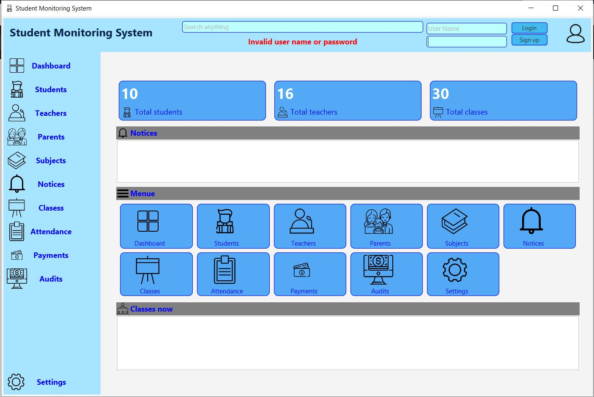

# student
JavaFX user interface created for *student management* 
Instructions for use:
 * press enter on password field to login (You can code login on your way)
 
[Click here to Download jar file](https://github.com/DarshanaUOP/student/raw/master/out/artifacts/student_jar/student.jar)

<i><b>Screenshots of the application<b></i>

>Welcome and login 
   
  
 The figure above is showing the loging window of the application. The menu tabs are unable to use while user enter his valid password. and if user do not have an login password, he can create new user account to use the application. 

 
>The dashboard
   
   
  The dashboard is showing in the above figure and it shows the current summery and the functionalities of the application.
